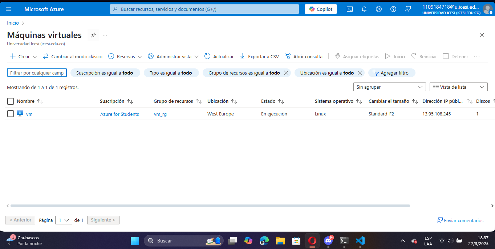
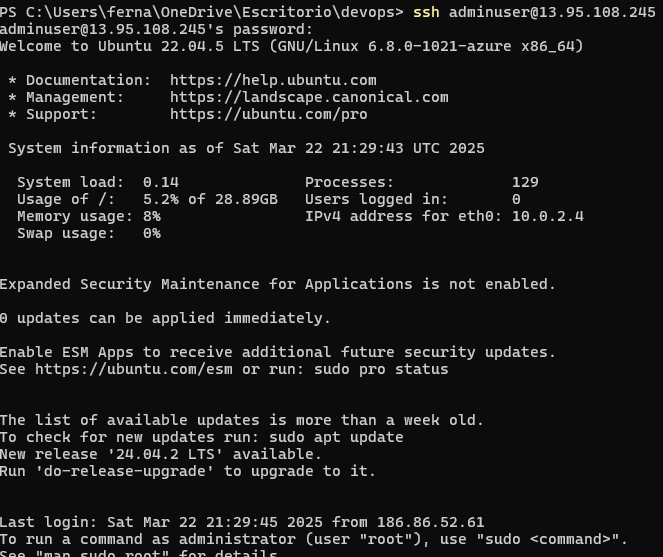
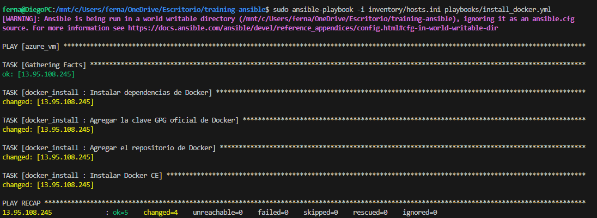
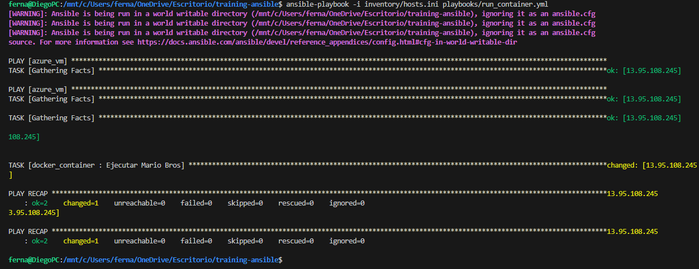
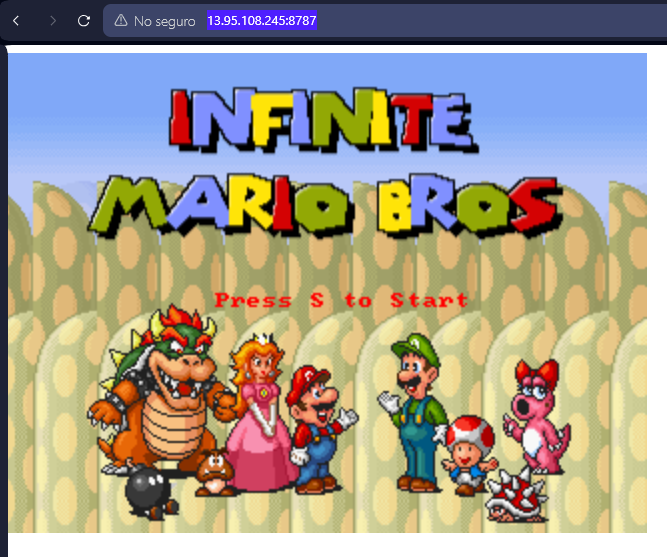

# Guía Paso a Paso: Cómo Ejecutar Mario Bros en una Máquina Virtual Usando Ansible

## Despliegue Automatizado de Máquina Virtual Linux en Azure (VM_TF)

Este proyecto facilita la implementación de una máquina virtual Linux en Microsoft Azure mediante Terraform.

### Estructura Modular
El despliegue se basa en módulos:
- **Módulo `vm`**: Administra la configuración de la red y la máquina virtual.
- **Configuración principal**: Gestiona el grupo de recursos, la red virtual y la subred.

La estructura del proyecto se divide en dos componentes principales: el módulo de máquina virtual y la configuración principal. Cada uno de estos componentes tiene archivos específicos que definen su funcionalidad dentro del despliegue automatizado en Azure utilizando Terraform.

El módulo de máquina virtual se encuentra dentro del directorio modules/vm y es el encargado de configurar la red y la infraestructura de la máquina virtual. En este módulo, el archivo main.tf se encarga de establecer la interfaz de red mediante azurerm_network_interface, crear una dirección IP pública con azurerm_public_ip, desplegar la máquina virtual Linux utilizando azurerm_linux_virtual_machine y configurar las reglas de seguridad para permitir conexiones SSH y el uso de Ansible a través de azurerm_network_security_group. Por otro lado, el archivo variables.tf define los parámetros que pueden personalizarse, como el nombre de la máquina virtual, su ubicación y las credenciales de acceso. Finalmente, el archivo outputs.tf expone la dirección IP pública de la máquina virtual, lo que facilita su identificación una vez desplegada.

La configuración principal del proyecto se encuentra en el directorio raíz (./) y se encarga de gestionar los recursos globales y la integración del módulo de la máquina virtual. En esta sección, el archivo main.tf define el proveedor de Azure, crea el grupo de recursos necesario para la infraestructura, configura la red virtual y la subred donde operará la máquina virtual e invoca el módulo vm con los valores adecuados. Además, el archivo variables.tf en este directorio contiene las variables globales esenciales para el proyecto, como la suscripción de Azure y la configuración de red, asegurando que toda la infraestructura esté bien organizada y parametrizada.

### Pasos para el Despliegue

#### Inicializar Terraform
```bash
terraform init
```

#### Validar la Configuración
```bash
terraform validate
```

#### Aplicar la Infraestructura
```bash
terraform apply
```




### Eliminación de la Infraestructura
Para eliminar todos los recursos creados, ejecuta:
```bash
terraform destroy
```

---

## Guía para Desplegar Super Mario con Ansible y Docker (ansible)

El proceso de despliegue de Super Mario Bros en un contenedor Docker utilizando Ansible comienza con la definición del inventario. En el archivo inventory/hosts.ini se especifican los servidores que Ansible gestionará, en este caso, una máquina virtual de Azure. Dentro de este archivo, se debe indicar la dirección IP de la máquina, el usuario de acceso y la contraseña correspondiente. Es importante reemplazar estos valores con los específicos del entorno en el que se ejecutará el despliegue.

A continuación, se configura Ansible a través del archivo ansible.cfg, donde se establecen parámetros esenciales para la ejecución de los playbooks. En este archivo se desactiva la verificación de claves SSH con host_key_checking = False, se define la ruta donde se almacenan los roles y se especifica la ubicación del archivo de inventario. Estas configuraciones permiten que Ansible gestione la máquina de manera eficiente y sin interrupciones por verificaciones de seguridad innecesarias.

El siguiente paso es la instalación de Docker, la cual se automatiza mediante el playbook playbooks/install_docker.yml. Este playbook ejecuta el rol docker_install, que contiene una serie de tareas definidas en roles/docker_install/tasks/main.yml. Entre estas tareas, se incluyen la instalación de dependencias necesarias (apt-transport-https, ca-certificates, curl, software-properties-common), la adición de la clave GPG oficial de Docker, el registro del repositorio de Docker en el sistema y, finalmente, la instalación de Docker CE en la máquina virtual. Este proceso asegura que Docker quede correctamente configurado y listo para ejecutar contenedores.

Una vez instalado Docker, se procede con la implementación del contenedor de Super Mario. Para ello, se utiliza el playbook playbooks/run_container.yml, el cual invoca el rol docker_container. Dentro del archivo roles/docker_container/tasks/main.yml, se encuentra la tarea principal, que es la ejecución de un contenedor basado en la imagen pengbai/docker-supermario:latest. Este contenedor se inicia con el nombre supermario-container y se expone en el puerto 8787, permitiendo que el juego pueda ser accesible desde un navegador web.

Gracias a esta estructura de automatización con Ansible, se logra un despliegue eficiente y reproducible de un entorno de juego en la nube, evitando configuraciones manuales y asegurando que el proceso pueda ser ejecutado en diferentes entornos con mínimos ajustes.

### Pasos para Ejecutar el Proyecto

#### 1️⃣ Instalar dependencias en la máquina virtual
Ejecuta el siguiente comando:

```bash
ansible-playbook -i inventory/hosts.ini playbooks/install_docker.yml
```



#### 2️⃣ Implementar el contenedor del juego
Ejecuta el siguiente comando:

```bash
ansible-playbook -i inventory/hosts.ini playbooks/run_container.yml
```



#### 3️⃣ Acceder al juego desde el navegador
Abre la siguiente dirección en tu navegador:

```
http://13.95.108.245:8787
```


